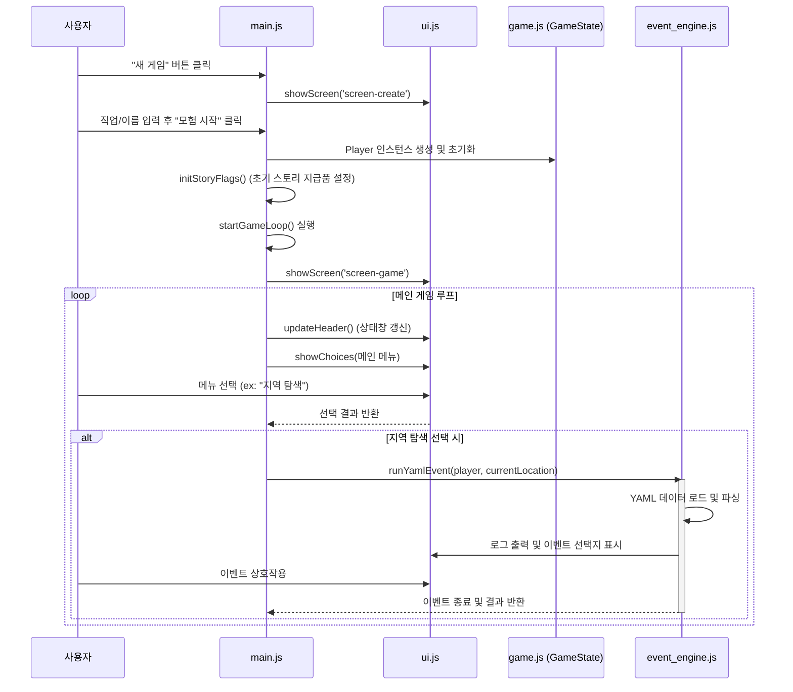

# 텍스트 RPG (Web 버전) 프로젝트 분석

본 문서는 `web` 디렉토리 내에 구현된 웹 기반 텍스트 RPG 프로젝트의 구조와 동작 방식을 분석한 문서입니다.

## 1. 프로젝트 개요

이 프로젝트는 HTML, CSS, Vanilla JavaScript를 활용하여 브라우저에서 동작하는 텍스트 기반 RPG 게임입니다. 사용자는 직업을 선택하여 캐릭터를 생성하고, 다양한 지역을 탐험하며 몬스터와 전투를 벌이고 스토리를 진행할 수 있습니다. 이벤트 및 데이터는 외부 YAML 파일 및 JS 데이터 객체를 통해 관리되어 확장성을 갖추고 있습니다.

## 2. 주요 구성 요소

* **`index.html`**: 게임의 전체 UI 골격을 구성합니다. 타이틀, 캐릭터 생성, 메인 화면, 전투, 상점, 인벤토리, 상태창 등의 화면(`screen`)이 미리 정의되어 있으며 CSS 클래스 조작으로 화면을 전환합니다.
* **`js/main.js`**: 게임의 진입점(Entry Point)입니다. 새 게임 시작, 불러오기, 메인 게임 루프, 타일맵 기반 이동 시스템을 담당합니다.
* **`js/game.js`**: `Player` 클래스 및 전역 상태를 관리하는 `GameState` 싱글톤 객체를 포함합니다. 플레이어의 스탯, 인벤토리, 레벨업 로직 및 LocalStorage를 이용한 저장/불러오기 기능을 제공합니다.
* **`js/ui.js`**: 화면 전환, 로그 출력, 선택지 표시, 모달 창 처리 등 DOM 조작과 관련된 UI 업데이트 로직을 전담합니다.
* **`js/event_engine.js`**: 외부 YAML 파일로 정의된 이벤트 스크립트를 파싱하고 실행하는 핵심 엔진입니다. 조건 분기(`if`), 확률 분기(`random`), 상태 변경, 전투 돌입 등의 액션을 순차적으로 처리합니다.
* **`js/combat.js`**: 턴제 전투 시스템을 구현합니다. 직업별 스킬, 공격력/방어력 계산, 상태이상(독), 적의 AI(기본 공격) 및 전투 승리 시 보상 처리를 담당합니다.
* **`js/data.js`**: 게임 내 사용되는 정적 데이터(아이템, 몬스터, 지역 정보 등)가 정의되어 있을 것으로 추정되는 파일입니다.

---

## 3. 시퀀스 플로우 (Sequence Flow)

게임의 초기화부터 메인 루프 진입, 그리고 지역 탐색(이벤트 실행)까지의 핵심 흐름입니다.



---

## 4. 프로세스 플로우 (Process Flow)

적과 조우했을 때 발생하는 턴제 전투 시스템의 동작 프로세스입니다.

```mermaid
flowchart TD
    Start([전투 시작]) --> Spawn[적 데이터 복제 및 생성]
    Spawn --> ShowBattle[전투 화면으로 전환 및 UI 초기화]
    ShowBattle --> TurnStart{전투 루프 시작\n(Player HP > 0 & Enemy HP > 0)}
    
    TurnStart -- Yes --> PlayerTurn[사용자 액션 대기]
    PlayerTurn --> Choice{행동 선택}
    
    Choice -- 일반 공격/스킬 --> CalcDmg[데미지 계산 및 적 HP 감소]
    Choice -- 아이템 --> UseItem[아이템 효과 적용 (회복/해독 등)]
    Choice -- 도망 --> Flee{도망 성공률 판정}
    
    Flee -- 성공 --> EndFlee([전투 종료 (도주)])
    Flee -- 실패 --> EnemyTurnCheck
    
    CalcDmg --> EnemyTurnCheck{적 HP > 0?}
    UseItem --> EnemyTurnCheck
    
    EnemyTurnCheck -- No --> Win[승리 처리 (EXP, 골드, 전리품 획득)]
    Win --> EndWin([전투 종료 (승리)])
    
    EnemyTurnCheck -- Yes --> EnemyTurn[적 턴 진행]
    EnemyTurn --> CalcEnemyDmg[적의 공격 데미지 계산 및 플레이어 방어 판정]
    CalcEnemyDmg --> ApplyPoison[독 데미지 적용]
    ApplyPoison --> TurnEndCheck{플레이어 HP > 0?}
    
    TurnEndCheck -- Yes --> TurnStart
    TurnEndCheck -- No --> GameOver([게임 오버 처리])
    
    TurnStart -- No --> EndCheck{적 HP <= 0?}
    EndCheck -- Yes --> Win
    EndCheck -- No --> GameOver
```

## 5. 분석 요약

* **분리된 아키텍처**: 데이터(YAML), UI 그리기(`ui.js`), 게임 상태(`game.js`), 로직(`main.js`, `combat.js`, `event_engine.js`)이 잘 분리되어 있어 유지보수 및 확장이 용이합니다.
* **이벤트 주도적 모델**: 하드코딩된 스토리가 아닌 `event_engine.js`를 통한 스크립트 기반 진행 방식을 채택하여, 코드 수정 없이 YAML 데이터 수정만으로 방대한 스토리와 퀘스트를 찍어낼 수 있는 구조입니다.
* **모바일 친화적 UI**: 인벤토리, 상점, 전투 등 모든 상호작용이 버튼 클릭(터치) 기반의 `showChoices` 방식으로 설계되어 모바일 기기에서도 원활한 플레이가 가능할 것으로 보입니다.
